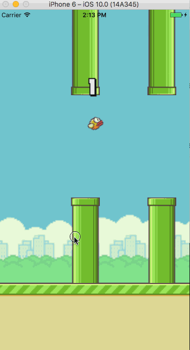

# Flappy Bird game experiment using React-Native

Inspiration: [Original FlappyBird game written in React Native](https://github.com/GeekyAnts/FlappyBird-ReactNative)

### Note: This project is using for learning about Animation in React Native

### Todo list
- [ ] Change to [React Native Animation](https://facebook.github.io/react-native/docs/animations.html) instead of using calculator
- [ ] Change pipes height
- [ ] Fix bugs when start game again
- [ ] Shared result
- [ ] Click to view result

## Demo

